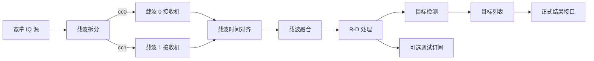
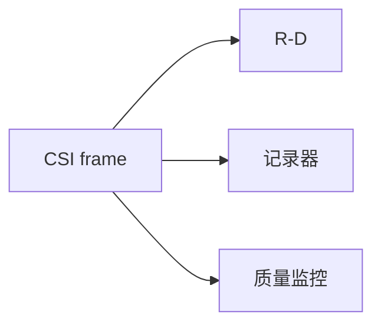
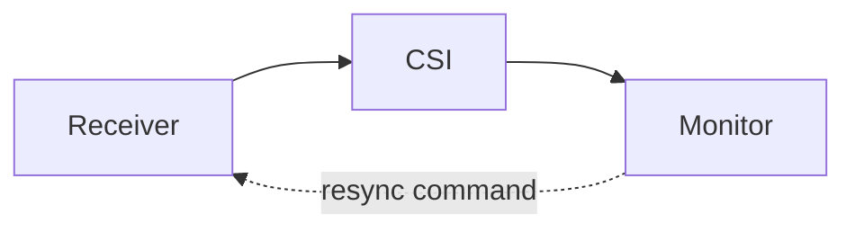
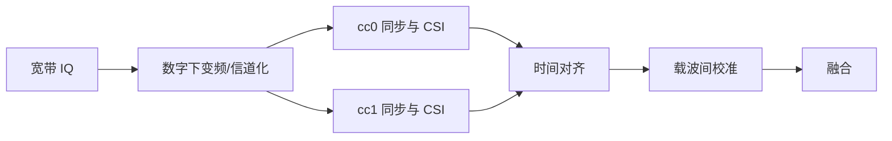

# LTESen DAG 数据管线设计

状态：设计草案，不代表已经实现。

本文只讨论 `LTESen_python` 的有效代码路径；MATLAB 工程的 `todo`
目录不在设计、迁移和兼容范围内。

## 1. 背景与结论

当前 `ltesen.ltepipe.Pipeline` 是一条线性链：模块按注册顺序依次接收同一条
消息。这个模型适合验证单载波处理流程，但不能自然表达以下需求：

- 同一份 CSI 同时进入 R-D 处理、质量监控和调试记录；
- R-D 谱同时进入目标检测与外部显示；
- 多个分量载波分别同步和估计 CSI，随后进行时间对齐与融合；
- 一个分支可以丢帧或退出，而核心感知分支继续运行。

下一代执行器应采用**数据平面 DAG（有向无环图）+ 独立控制平面**。
首个实现仍保持单线程、同步和确定性，只增加命名端口、扇出、多输入节点与
显式结束语义。线程、进程和分布式执行不属于第一阶段。



这里的 DAG 只描述数据依赖。重新捕获、参数更新和停止请求属于控制平面，
允许向上游节点发送命令，但不会因此在数据图中形成环。

## 2. 设计目标

1. 支持一对多扇出和多对一汇合。
2. 支持单载波与多载波使用同一套执行模型。
3. 明确数据连续性、时间、载波和来源，避免仅靠整数 `epoch` 猜测上下文。
4. 让缓存、配对和缺失数据策略由汇合节点显式负责。
5. 保持核心处理库无 GUI；GUI 通过有界订阅接口消费结果。
6. 默认执行结果可复现，便于与 MATLAB 和离线录制数据做数值验证。
7. 保留当前线性 `Pipeline` 的迁移通道，避免一次重写全部算法模块。

## 3. 非目标

第一版不处理以下问题：

- 动态热插拔或运行中修改拓扑；
- 数据平面中的有向环；
- 跨主机分布式执行；
- 自动决定多载波相干融合算法；
- 自动并行化所有分支；
- 将 Matplotlib、Qt 或其他 GUI 放入 `ltesen` 核心包。

## 4. 现有机制与 DAG 机制的对应

| 当前线性机制 | DAG 设计 | 调整原因 |
| --- | --- | --- |
| `modules: list[Module]` | 命名节点与显式边 | 注册顺序不足以表达分支和汇合 |
| 单一 `input_type/output_type` | 多个命名输入、输出端口 | 区分载波、正式结果和诊断输出 |
| 一个 `Result.message` | 零个或多个 `Emission` | 一个节点需要向多个端口输出 |
| `Message.has_packet=False` | 零 emissions | 缓存等待不应产生需要继续路由的空消息 |
| `stop("end-of-file")` | 每个流或端口的 EOS | 一个源结束不能停止其他源 |
| 按列表位置 reset 下游 | 按可达关系和 stream 传播 | DAG 中不存在唯一的“后续列表” |
| 全局 `Runtime["lte"]` | stream + version 上下文 | 各载波的小区配置和 epoch 不同 |
| artifact 随 Message 传播 | 显式 artifact collector/端口 | 广播时不能重复或遗漏最终结果 |

这意味着不能只把 `Pipeline.modules` 从列表换成邻接表；数据包头部、处理结果、
结束语义、重置范围和 Runtime 都必须一起调整。

## 5. 核心对象

### 5.1 Graph、Node、Port 与 Edge

- `Graph`：持有节点和边，验证拓扑并创建执行计划。
- `Node`：算法或 I/O 单元，对应当前的 `Module`。
- `InputPort`：声明端口名、可接受的数据类型和是否必需。
- `OutputPort`：声明端口名和可能产生的数据类型。
- `Edge`：连接一个输出端口和一个输入端口，并携带队列策略。
- `SourceNode`：没有数据输入，通过 `poll()` 产生数据或流结束事件。
- `SinkNode`：没有数据输出，用于保存、回调或向外部应用交付结果。
- `JoinNode`：拥有多个命名输入端口，内部负责缓存和时间对齐。

节点之间不能直接调用彼此的方法。所有数据都必须由图执行器沿 `Edge`
投递，这样才能统一处理类型检查、重置、统计和背压。

### 5.2 命名端口

当前模块只有一个 `input_type` 和一个 `output_type`。DAG 中改为命名端口：

```python
input_ports = {
    "cc0": InputPort(types={"csi-frame"}),
    "cc1": InputPort(types={"csi-frame"}),
}
output_ports = {
    "out": OutputPort(types={"aligned-csi-frame"}),
}
```

命名端口解决两个问题：同一节点可以区分不同载波或不同用途的输入；一个
节点也可以把正式结果、诊断数据和质量信息送往不同输出端口。

端口类型在图初始化时静态检查，在运行时再次检查实际包类型。一个输出端口
可以连接多个下游端口，表示广播；同一个输入端口默认只允许一条入边，除非
它显式声明为多生产者端口。

### 5.3 Packet 与必需头部

当前 `Packet(type, data, meta, quality)` 的开放字典适合快速迁移，但 DAG
汇合需要一组不能缺失、不能随意改名的头部字段。建议保留开放的 `meta`，
同时新增不可变的 `PacketHeader`：

```python
@dataclass(frozen=True)
class StreamKey:
    session_id: str
    source_id: str
    carrier_id: str

@dataclass(frozen=True)
class PacketHeader:
    packet_type: str
    schema_version: int
    stream: StreamKey
    epoch: int
    sequence: int
    event_time_ns: int
    duration_ns: int
    context_version: int
    trace_id: str

@dataclass(frozen=True)
class Packet:
    header: PacketHeader
    data: Mapping[str, Any]
    meta: Mapping[str, Any]
    quality: Mapping[str, Any]
```

字段含义：

- `session_id`：一次录制或一次在线运行的全局标识；
- `source_id`：物理采集源，例如某个 SDR 或 SigMF 记录；
- `carrier_id`：逻辑分量载波，例如 `cc0`、`cc1`；
- `epoch`：该流的连续区间编号，重新捕获后递增；
- `sequence`：该流内严格单调的包序号；
- `event_time_ns`：信号对应的采集时间，不是处理到达时间；
- `duration_ns`：该包覆盖的信号时间范围；
- `context_version`：使用的 LTE 小区上下文版本；
- `trace_id`：用于跟踪一次数据在各分支中的派生关系。

多载波汇合不能仅使用 `sequence`，因为各载波可能有不同的帧边界、重新捕获
次数或处理延迟。默认对齐键应是 `session_id + event_time_ns`，同一采集设备
还可以使用绝对原始采样位置作为更精确的辅助字段。

### 5.4 不可变与数据所有权

广播时不应复制大型 IQ、CSI 或 R-D 数组。一个 `Packet` 可以被多条边共享，
前提是节点不得原地修改输入：

- 输入映射在进入图后视为只读；
- NumPy 数组应设置为只读，或明确约定 copy-on-write；
- 节点需要修改数据时必须创建新的输出数组；
- `meta` 和 `quality` 的修改通过创建新映射完成。

`dataclass(frozen=True)` 只能冻结对象属性，不能自动冻结字典和 NumPy 数组，
因此实现阶段必须增加递归只读检查和针对数组的测试。

## 6. 处理结果与路由

### 6.1 用 Emission 代替“空 Message”

当前 `Message.has_packet=False` 同时表示“缓存阶段尚无输出”和“只携带
artifact”。进入 DAG 后，这种含义容易在多个分支间产生歧义。建议新接口为：

```python
@dataclass(frozen=True)
class Emission:
    port: str
    packet: Packet

@dataclass(frozen=True)
class NodeResult:
    emissions: tuple[Emission, ...] = ()
    controls: tuple[ControlEvent, ...] = ()
    artifacts: tuple[Artifact, ...] = ()
```

- 缓冲未完成：返回零个 `emissions`；
- 一个普通变换：返回一个 `Emission("out", packet)`；
- 同时输出目标和诊断：返回多个不同端口的 `Emission`；
- 只产生控制事件：`emissions` 为空，`controls` 非空。

这样每个输出是否存在都是显式的，不需要让“空包”继续穿过整张图。

### 6.2 扇出

当一个输出端口连接多个下游时，执行器为每条边创建一个投递记录，但共享
同一个不可变 `Packet`：



每个分支独立产生或不产生输出。一个调试分支丢弃数据不能影响主处理分支。

### 6.3 汇合

执行器只负责把数据投递到正确的输入端口，不自动等待“所有父节点”。真正的
配对规则属于专用 `JoinNode`，因为不同算法对缺失数据有不同容忍度。

建议 `JoinNode` 支持以下策略：

- `all`：所有配置载波都到齐才输出；
- `quorum`：达到最小载波数量即可输出；
- `best_effort`：水位线到达后，用现有载波输出并标记缺失项。

每个输出必须记录：

- 实际参与的载波列表；
- 每个载波的输入 epoch；
- 最大时间对齐误差；
- 缺失或迟到的载波；
- 融合是否满足算法要求。

汇合后的连续性不能用单一父流的 epoch 表示。建议产生新的复合 epoch，并在
`meta.input_epochs` 中保留例如 `{"cc0": 3, "cc1": 2}` 的来源向量。

## 7. 时间、水位线与流结束

### 7.1 事件时间

所有对齐都使用采集信号的事件时间，而不是 Python 函数被调用的时间。对同一
宽带采集拆出的载波，事件时间应从共享原始采样位置推导；对独立设备，需要先
经过时钟同步和时间校准，否则只能进行非相干融合。

### 7.2 Watermark

多输入节点需要知道某个旧时间点的数据是否仍有可能到达。每个源或上游分支
因此可以发布 watermark：在该时间之前不会再产生新数据。

`JoinNode` 根据所有输入 watermark 决定：

- 输出已经完整的配对；
- 按策略输出不完整配对；
- 丢弃确定无法配对的迟到数据；
- 更新迟到、缺失和等待时间统计。

离线文件源的 watermark 可以精确推进；实时源则根据已读取采样位置和允许
迟到时间推进。

### 7.3 EndOfStream

当前某个 source 返回 `stop("end-of-file")` 会停止整条 Pipeline。多源 DAG
中必须改为端口级 `EndOfStream`：

- 一个输入结束不等于整张图结束；
- EOS 沿对应边传播；
- 汇合节点收到全部必需输入的 EOS 后刷新或丢弃剩余缓存，再输出自己的 EOS；
- 当所有源结束且事件队列为空时，图自然完成；
- 致命错误或显式用户请求才产生全图停止。

## 8. 控制平面

数据图保持无环；控制命令可以按节点名发送到任意节点，包括上游：



建议定义强类型控制对象：

```python
@dataclass(frozen=True)
class Command:
    target: str
    name: str
    payload: Mapping[str, Any]
    command_id: str

@dataclass(frozen=True)
class ResetEvent:
    event_id: str
    origin: str
    stream: StreamKey
    old_epoch: int
    new_epoch: int
    reason: str
```

命令在两个节点处理调用之间由调度器分发，禁止在一个节点内部同步调用另一个
节点，以避免重入和隐式依赖。

### 8.1 Reset 传播

重新捕获只重置受影响 stream 的后代，而不是清空整张图。执行器沿数据边遍历
所有可达节点，每个节点对同一 `event_id` 只接收一次重置，避免菱形 DAG
重复调用。

多输入节点应按 stream 清除对应缓存；如果这使一个已形成的复合流失效，则
它创建新的复合 epoch，并向自己的下游继续传播重置。

### 8.2 Stop 范围

停止事件必须声明范围：

- `node`：停用单个可选节点；
- `subgraph`：停止该节点及其后代；
- `graph`：停止整个运行；
- `stream`：只终止某一条逻辑流。

外部 GUI 关闭窗口通常只意味着取消订阅，不应产生 `graph` stop。只有用户在
GUI 中明确执行“停止感知”操作时，才发送全图停止命令。

## 9. Runtime 与 LTE 上下文

当前 `Runtime.set_context("lte", value)` 会覆盖一个全局 LTE 上下文。多载波
中每个载波可能具有不同的 `NCellID`、带宽、采样率和重新捕获 epoch，因此
上下文必须带命名空间和版本。

建议 Runtime 提供不可变、版本化上下文仓库：

```python
context_ref = runtime.publish_context(
    stream=StreamKey(session_id, source_id, carrier_id),
    name="lte",
    value=lte_context,
)
lte_context = runtime.get_context(context_ref)
```

每个 Packet 的 `context_version` 指向生成它时使用的上下文。发布新版本不能
修改旧版本，确保队列中尚未处理的旧包仍能取得正确配置。

图级服务，例如日志、指标、时钟和 artifact 存储，可以继续放在 Runtime；
算法数据和易变的小区状态不应作为无版本的全局变量共享。

## 10. 调度与背压

### 10.1 第一阶段：同步确定性调度

第一版采用单线程事件队列：

1. 按轮询顺序调用一个可用 Source；
2. 将其 emissions 放入边队列；
3. 按稳定的拓扑顺序投递事件，直到当前队列排空；
4. 再轮询下一个 Source；
5. 控制命令在两次节点调用之间处理。

这种方式便于单元测试、复现和 MATLAB 对照，也能先验证 DAG 语义。模块不能
依赖同一拓扑层兄弟节点的执行先后顺序。

### 10.2 边队列策略

每条 Edge 声明容量和溢出策略：

- `block`：不得丢失，适合核心离线计算；
- `drop_oldest`：保留最新数据，适合 GUI；
- `drop_newest`：保持历史连续性，适合某些记录器；
- `latest_only`：容量为 1，适合状态和实时预览。

同步第一版中核心边通常能立即排空，但现在定义这些语义，可以避免未来引入
异步执行时改变模块接口。任何丢弃都必须进入 edge 指标，不能静默发生。

### 10.3 后续并发

只有性能分析证明需要时，才增加线程或进程执行器。算法模块接口保持不变，
由执行器决定调度方式。Qt 等 GUI 必须在自己的主线程更新，核心 DAG 只向
有界队列写入不可变结果。

## 11. 错误、完成与 Artifact

### 11.1 错误策略

每个节点配置一种明确策略：

- `fail_graph`：核心算法异常，默认策略；
- `disable_branch`：可选诊断分支失败后停用；
- `drop_packet`：仅用于明确允许坏包的节点；
- `retry`：仅用于外部 I/O，并要求次数和退避上限。

错误报告应包含节点、输入端口、stream、epoch、sequence 和 trace ID。

### 11.2 Finalize

图停止后按逆拓扑顺序调用 `finalize()`，但节点产生的最终 emissions 仍沿正常
数据边投递。Join 和窗口节点必须在收到 EOS 时先处理自己的剩余缓存，不能等
全图 finalize 后再尝试把数据送给已经关闭的下游。

### 11.3 Artifact

Artifact 不再附着在一个可能被广播的空 Message 上。它是显式的
`NodeResult.artifacts`，由 Runtime 的 artifact collector 收集，或从专用输出
端口交给保存节点。每个 artifact 带 producer、stream、时间范围和类型。

## 12. 多载波感知建议拓扑

多载波可有两种输入形式。

### 12.1 同一宽带采集



所有载波共享采集时钟，时间对齐相对容易；但相干融合仍需要校准载波间固定
相位、群时延和硬件通道差异。

### 12.2 独立采集源

每个采集源拥有独立 `source_id`。在进入 `CarrierJoin` 前必须先完成时间基准
映射。若无法保证载波间相位一致，只能先做每载波 R-D 或目标检测，再进行
非相干谱融合或目标级融合。

图框架只负责对齐和携带质量信息，不应把“相干还是非相干”的选择隐藏在通用
Join 中。建议拆成：

```text
CarrierJoin（对齐） -> CarrierCalibration（校准） -> CarrierFusion（算法）
```

### 12.3 Receiver 的职责需要拆分

当前 `ltetracking.Receiver` 同时拥有文件读取、初始捕获、重采样、同步跟踪、
OFDM 和 CSI 提取。单载波时这样使用方便，但同一宽带源拆出多个载波后，不能
让多个 Receiver 各自重复读取整份文件。

建议逐步拆成：

```text
IQSource
  -> CarrierChannelizer
      -> CarrierReceiver(cc0)
      -> CarrierReceiver(cc1)
```

- `IQSource` 只负责物理采集、绝对时间和原始采样位置；
- `CarrierChannelizer` 负责频移、滤波、抽取并保留时间映射；
- `CarrierReceiver` 负责一个 LTE 载波的捕获、同步、OFDM 和 CSI；
- 离线随机访问需求由只读 `IQStore` 服务或载波缓冲器提供，不让算法节点直接
  控制全局文件游标。

迁移初期可以保留现有 `Receiver` 作为单载波 `SourceNode` 适配器，待多载波
输入实现时再拆分内部职责。

## 13. 核心输出与外部 GUI

核心 DAG 的正式结果是 `target-list`，R-D 谱是可选中间产品：

```text
CSI -> RangeDopplerFrame -> Detector -> TargetList
```

建议提供两个稳定结果结构：

```python
@dataclass(frozen=True)
class Target:
    range_m: float
    velocity_mps: float
    score_db: float
    carrier_ids: tuple[str, ...]

@dataclass(frozen=True)
class TargetList:
    header: PacketHeader
    targets: tuple[Target, ...]
```

Matplotlib、Qt 或 Web 前端使用外部订阅：

```python
subscription = graph.subscribe(
    output="range_doppler",
    capacity=1,
    overflow="drop_oldest",
)
```

GUI 只读取订阅队列。关闭 GUI 只取消 subscription；核心图、录制和目标检测
继续运行。核心 `ltesen` 可以提供订阅协议和 `LatestValueSink`，但不依赖任何
GUI 库。

## 14. Python API 草案

```python
graph = Graph(execution_config)

graph.add_node("source", WidebandSource(recording))
graph.add_node("channelizer", CarrierChannelizer(carriers))
graph.add_node("cc0_receiver", CarrierReceiver(cc0_config))
graph.add_node("cc1_receiver", CarrierReceiver(cc1_config))
graph.add_node("carrier_join", CarrierJoin(["cc0", "cc1"]))
graph.add_node("range_doppler", RangeDopplerProcessor(rd_config))
graph.add_node("detector", TargetDetector(detection_config))

graph.connect("source.out", "channelizer.in")
graph.connect("channelizer.cc0", "cc0_receiver.in")
graph.connect("channelizer.cc1", "cc1_receiver.in")
graph.connect("cc0_receiver.out", "carrier_join.cc0")
graph.connect("cc1_receiver.out", "carrier_join.cc1")
graph.connect("carrier_join.out", "range_doppler.in")
graph.connect("range_doppler.out", "detector.in")

graph.expose_output("range_doppler", "range_doppler.out")
graph.expose_output("targets", "detector.out")
graph.validate()
summary = graph.run()
```

节点类型、端口类型、环路、缺失必需输入和重复名称都在 `validate()` 阶段
报错，而不是处理到一半才失败。

## 15. YAML 组合草案

第一阶段仍建议在 Python composition root 中构图，因为它最易重构和调试。
当节点接口稳定后，可以让 YAML 从受控 registry 选择节点类型：

```yaml
graph:
  nodes:
    source:
      type: wideband_source
      config: recording
    channelizer:
      type: carrier_channelizer
      config: carriers
    cc0_receiver:
      type: carrier_receiver
      config: carriers.cc0
    cc1_receiver:
      type: carrier_receiver
      config: carriers.cc1
    carrier_join:
      type: carrier_join
      config: carrier_join
    range_doppler:
      type: range_doppler
      config: range_doppler
    detector:
      type: target_detector
      config: detection

  edges:
    - {from: source.out, to: channelizer.in}
    - {from: channelizer.cc0, to: cc0_receiver.in}
    - {from: channelizer.cc1, to: cc1_receiver.in}
    - {from: cc0_receiver.out, to: carrier_join.cc0}
    - {from: cc1_receiver.out, to: carrier_join.cc1}
    - {from: carrier_join.out, to: range_doppler.in}
    - {from: range_doppler.out, to: detector.in}
```

YAML 中的 `type` 只能引用注册表中的已知类型，不允许直接导入任意 Python
路径。算法参数和拓扑定义应分开验证。

## 16. 兼容迁移方案

建议按以下阶段迁移，任一阶段结束后现有单载波流程都应可运行。

### 阶段 A：冻结语义

- 为现有 Packet 补充必需 stream/time 字段检查；
- 引入 `PacketHeader`、`PortSpec`、`Emission` 和 `NodeResult`；
- 保留当前 `Message`、`Result`，提供适配器；
- 增加数组只读约定和测试。

### 阶段 B：Graph 与线性兼容层

- 实现节点注册、命名端口、边和 DAG 校验；
- 实现同步确定性调度器；
- 让旧 `Pipeline.register()` 成为自动连接 `out -> in` 的 Graph 包装器；
- 保持当前测试和脚本通过。

### 阶段 C：扇出与外部订阅

- 支持一个输出端口连接多个下游；
- 实现 `CollectorSink`、`CallbackSink` 和 `LatestValueSink`；
- 将 R-D viewer 移出 `ltesen` 核心包；
- 验证 GUI 慢速或关闭不会阻塞主链。

### 阶段 D：多输入、Watermark 与 EOS

- 实现命名多输入节点；
- 实现 watermark、端口级 EOS 和 Join 缓存策略；
- 将 reset 改为 stream-scoped，并在菱形图中去重；
- 增加双源乱序、迟到、缺失和单源提前结束测试。

### 阶段 E：载波聚合

- 实现宽带信道化或多源适配；
- 实现 `CarrierJoin`、校准元数据和融合接口；
- 先支持非相干融合，再在具有可靠校准数据时实现相干融合；
- 最终输出统一的 `target-list`。

### 阶段 F：按需并发

- 基于性能测试决定是否实现线程、进程或 GPU 执行器；
- 保持节点与 Packet 接口不变；
- 为每条边实施有界队列和可观测背压策略。

## 17. 测试要求

DAG 基础设施至少需要以下自动测试：

1. 环路、端口不存在和类型不兼容在初始化时失败；
2. 扇出分支收到同一不可变 Packet，且一个分支不能修改另一个分支的数据；
3. 一个分支零输出或停用不影响其他分支；
4. 菱形拓扑中的 reset 对每个后代只调用一次；
5. 多源调度不会长期饿死任一源；
6. Join 按事件时间而非到达顺序匹配；
7. watermark 能释放完整、不完整和确定无法匹配的窗口；
8. 单个源 EOS 不会过早停止其他源；
9. `drop_oldest` 等策略具有准确的丢包计数；
10. 旧线性 Pipeline 通过适配层保持现有行为；
11. 双载波合成数据能得到确定的对齐和融合结果；
12. GUI 订阅变慢、断开或关闭时核心目标输出连续。

## 18. 建议的代码布局

```text
ltesen/ltepipe/
├── packet.py        # PacketHeader、Packet、StreamKey
├── ports.py         # InputPort、OutputPort、EdgeSpec
├── node.py          # Node、SourceNode、SinkNode、JoinNode
├── result.py        # Emission、NodeResult、Artifact
├── control.py       # Command、ResetEvent、StopEvent、EOS、Watermark
├── graph.py         # 构图、DAG 校验、公开输出
├── scheduler.py     # 同步执行器，未来可增加其他执行器
├── runtime.py       # 版本化上下文、服务、指标
└── compatibility.py # 当前 Module/Pipeline 适配层

ltesen/lteca/
├── channelizer.py
├── join.py
├── calibration.py
└── fusion.py
```

## 19. 已确定的关键决策

- 数据平面使用 DAG，控制平面与数据边分离；
- 汇合规则由显式 Join 节点负责，执行器不做领域推断；
- 第一版保持同步、单线程、确定性；
- 对齐使用事件时间，sequence 只用于单流连续性检查；
- EOF 改为端口级 EOS，不能再等同于全图 stop；
- Runtime 上下文按 stream 和版本存储；
- 广播共享不可变 Packet，不复制大型数组；
- GUI 使用有界外部订阅，不作为核心处理分支；
- 旧 Pipeline 通过兼容层逐步迁移，而不是一次删除。

实现前仍需通过实验确定的主要事项是：实际采集设备能提供怎样的跨载波时间
基准和相位校准信息。这会决定载波融合的算法能力，但不影响上述 DAG、消息和
生命周期接口。
